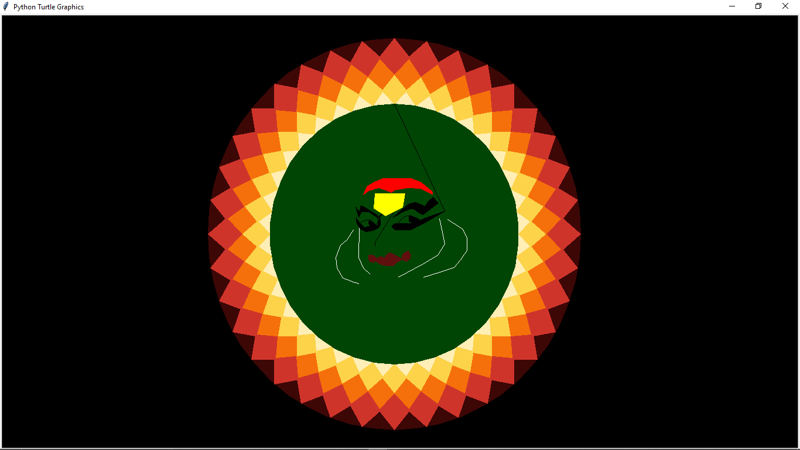

# code-a-Pookkalam Project 🌸

This project creates a **Kathakali face drawing inside a traditional Pookkalam** using Python's `turtle` graphics.  

 
The project is provided in **two formats**:  

1. **Website Version**  
   - A simple webpage with an **embedded Trinket link** so the Kathakali + Pookkalam can be run directly in the browser.  
   - No installation needed – just open the website and interact.  

2. **Raw Python File**  
   - The complete `.py` file that can be run locally using Python (with `turtle` module installed).  
   - This version does not have Trinket’s coordinate system issue.  

---

## ⚠️ Difference between Raw Python and Trinket
- In the **Raw Python file**, coordinates work normally (`turtle` uses the usual origin).  
- In **Trinket**, the **y-axis is inverted**, making the Kathakali appear upside down.  
- Fix: We created a **custom `fixed_goto(x, y)` function** that automatically flips the y-coordinate before moving the turtle.  
  ```python
  def fixed_goto(x, y):
      goto(x, -y)   # Invert y-axis for Trinket

## 🚀 How to Run
### Option 1: Website (Embedded Trinket)
1. Open the website link provided.  
2. The Trinket embed will display the Kathakali inside the Pookkalam.  
3. Press **Run ▶** to see the drawing.  

### Option 2: Local Python File
1. Download the `kathakali_pookkalam.py` file.  
2. Make sure you have Python installed (`>=3.8`).  
3. Run in terminal:  
   ```bash
   python kathakali_pookkalam.py
🖼️ Preview

